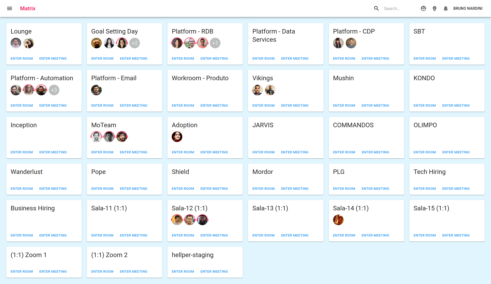
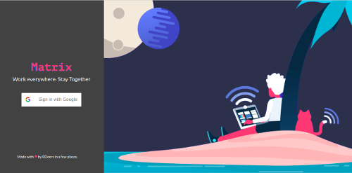
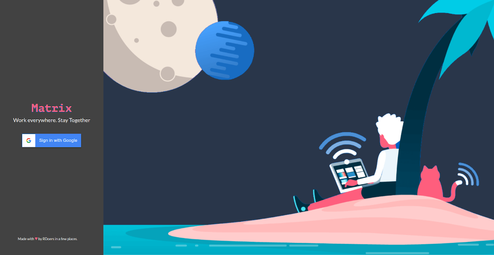
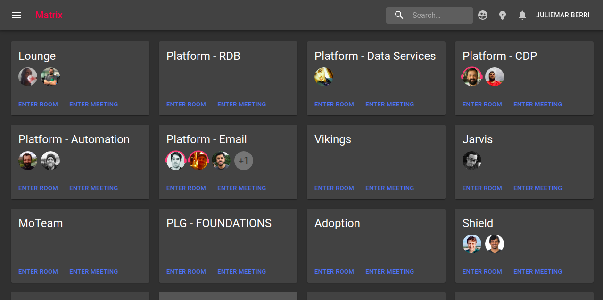
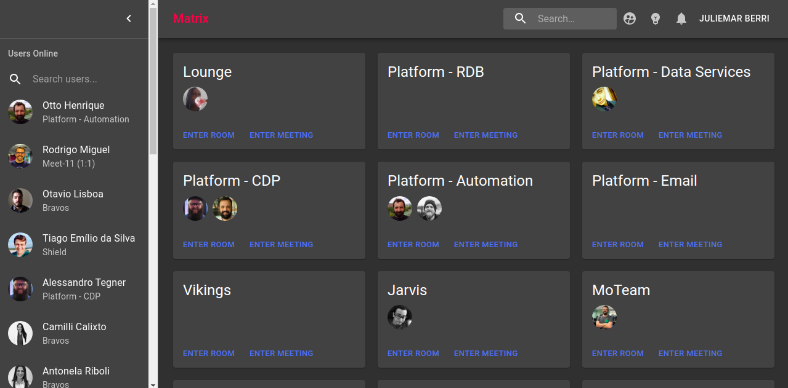
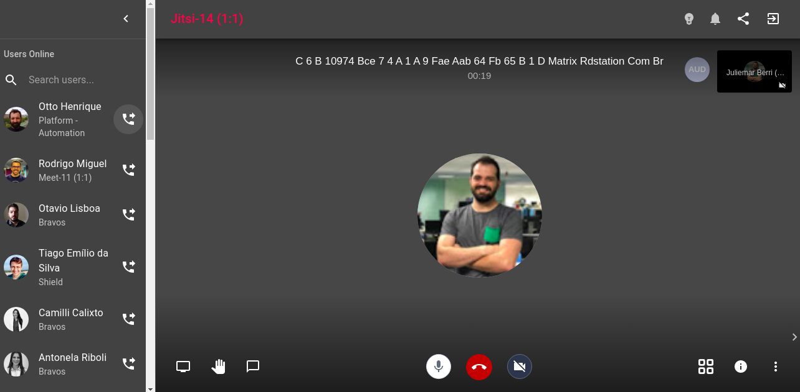
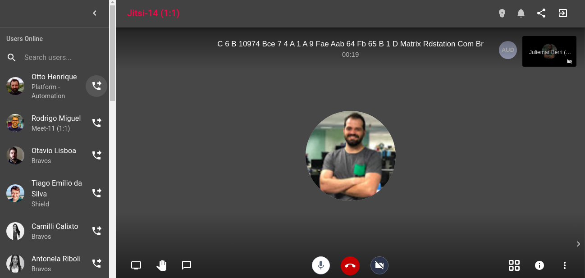

<h1 align="center">#matrix</h1>

<p align="center">Online open-source workplace for distributed teams.</p>

<p align="center">
  <a href="https://codeclimate.com/github/ResultadosDigitais/matrix/maintainability"></a>
  <a href="https://circleci.com/gh/ResultadosDigitais/matrix"></a>
</p>

## Welcome to the **#matrix**

The objective of **#matrix** project is to offer a virtual environment office, as nice as physical offices. When we are working in a physical office is very common entering in discussion threads in many different environments, for example: on coffee, on lunch and others.

When we are working remotely there are no conversations like in a physical office. The **#matrix** project was born as a proposal to better that experience. The idea is to create a lot of virtual rooms where people can see and enter these rooms to participate.

**#matrix** produces a virtual office for remote teams. In this project, you can run a virtual office to simulate the physical environment. Read more on [this post in Medium](https://medium.com/rd-shipit/matrix-d4cfc4ad4c75).



## Authentication

The login is so simple. You only need to create a google client id and configure the environment variable `GOOGLE_CREDENTIAL=xxxxxxxxxxx.apps.googleusercontent.com`. Follow [this step by step](/docs/GOOGLE-CREDENTIAL-STEP-BY-STEP.md) to configure your own google client key.

|                                 Login                                 |                                   Login in Dark Mode                                    |
| :-------------------------------------------------------------------: | :-------------------------------------------------------------------------------------: |
|  |  |

## The rooms Inside of #matrix
 
The inside of **#matrix** there are some rooms. In this rooms is possible to see others colleagues and if they are talking or in a meeting in the avatar will appear a head set icon. (eg. In the image the guys in the Platform-Email room are in a meeting)  

|                              Office Page                               |                                     With Sidebar                                     |
| :--------------------------------------------------------------------: | :----------------------------------------------------------------------------------: |
|  |  |

## The meeting room

You can only enter in a room to show for the other that you are available there through the `ENTER ROOM` button or enter in a meeting through the button `ENTER MEETING`. 

|                                Meeting Room                                |                                          With Sidebar                                           |
| :------------------------------------------------------------------------: | :---------------------------------------------------------------------------------------------: |
|  |  |

## Getting Started

If you want run the **#matrix**, you need follow steps:

1. We are using Google to authorizations, you need create a credential [here](/docs/GOOGLE-CREDENTIAL-STEP-BY-STEP.md) you can follow step by step

2. Run application with docker compose:

		$ docker-compose up

3. Open your browser and access: 

		http://localhost:8080/

4. When you finish, you can run:

		$ docker-compose down
		

## On GCP 
If you prefer, you can run **#matrix** on GCP:

[](https://deploy.cloud.run?git_repo=https://github.com/ResultadosDigitais/matrix&revision=gcp-deploy-button)


## On Heroku
If you prefer, you can run **#matrix** in Heroku: 

[](https://heroku.com/deploy?template=https://github.com/ResultadosDigitais/matrix)


## Environments

The **#matrix** project has some environments that important to define.

1. We are using Google to authorizations, you need create a credential [here](https://developers.google.com/identity/sign-in/web/sign-in) and before define this:

		GOOGLE_CREDENTIAL=${paste_your_credention_here}

2. If you are running with ssl It's important to configure SSL, to define this:

		ENFORCE_SSL=true

3. The **#matrix** needs to know, where it get rooms definitions:

		ROOMS_SOURCE=ENVIRONMENT

4. There is a config that define the rooms of The **#matrix**, if you prefer you can generate the unique id per room [here](https://www.uuidgenerator.net), to define this:


		ROOMS_DATA=[
		   {
		      "id":"${UUID}",
		      "name":"Lounge",
		      "disableMeeting":true
		   },
		   {
		      "id":"${UUID}",
		      "name":"WAR ROOM CDP"
		   },
		   {
		      "id":"${UUID}",
		      "name":"Data Services",
			  "externalMeetUrl": "https://external-url-room/key-room"
		   }
		 ]

### Environments Variables with docker
If you intend to run Matrix with docker, is very simple to set the environment variables. Just needs create a file on root path of project called variables.env, like sample below:

```
GOOGLE_CREDENTIAL=XXXXXX.googleusercontent.com #Required to authenticate on matrix
#ENFORCE_SSL=false
#ROOMS_SOURCE=ENVIRONMENT
#ROOMS_DATA=[{"id":"17755865-e0a6-4809-b389-eeff5590fd3d","name":"ValarDohaeris"},{"id":"490693fb-1751-498a-a23a-3785e677530c","name":"Osiris"},{"id":"da5eef6b-9e0c-4c32-81eb-17596114bf5b","name":"Icarus"},{"id":"e8ed1b89-afa9-469f-8108-e527b51c76a1","name":"Caduceus"},{"id":"bab0452c-bbfa-4365-b263-6aa9d26d8e33","name":"Brahma"},{"id":"706e8018-8e4e-40a2-a433-97535db6cc54","name":"Novalis"},{"id":"59008e8f-a961-4ad2-a2e4-b31b3e398a50","name":"Vigilant"},{"id":"2acbea57-64ba-4c55-9d20-042843c6e225","name":"Zion"}]
```

### External Meet
The default video conferencing in meetings is [Jitsi](https://jitsi.org/jitsi-meet/), but you can change that in any room, using [Meet](https://meet.google.com/) or [Zoom](https://zoom.us/). For that, you just need provide the parameter `externalMeetUrl` in your room config:
```
ROOMS_DATA=[
		   {
		      "id":"${UUID}",
		      "name":"Meeting External",
			  "externalMeetUrl": "https://external-url-room/key-room"
		   }
		 ]
```

# Running in Production
If you will run in production we strongly recomend to you close your environmen using an internal VPN. In this solution everybody with the link and a valid google credential can enter in your virtual office. Because of this is important to you mantain your environment closed. Or you can help us implementing to define a whitelist domains with environment variable. 


# Contributing
We encourage you to contribute to The **#matrix**!

Everyone interacting in **#matrix** codebase, issue trackers, chat rooms, and mailing lists is expected to follow [code of conduct](docs/CODE_OF_CONDUCT.md).


## License
The **#matrix** is released under the [MIT License](docs/LICENSE)


`"The answer is out there, Neo, and it's looking for you, and it will find you if you want it to."`
